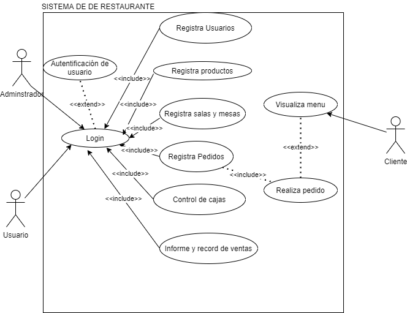

# Proyecto Restaurante
## Introducción
## Funcionalidades principales
-	Módulo de Usuarios y privilegios.
Módulo de salas y mesas.
El usuario podrá crear las salas y mesas del restaurante para que cuando un cliente tome esa mesa automáticamente se cambie de color cuando el mesero registre el pedido en el sistema.  
-	Módulo de Platos y categorías 
-	Módulo de inventarios e ingredientes personalizados.
El usuario pueda seleccionar los ingredientes para un plato que se prepara en el menú del restaurante y con ello dar alerta de que ingredientes se está acabando.
-	Módulo de ventas.
-	Módulo de caja
-	Módulo de informes y record de ventas

## Caso de uso

## Maqueta
## Repositorio

